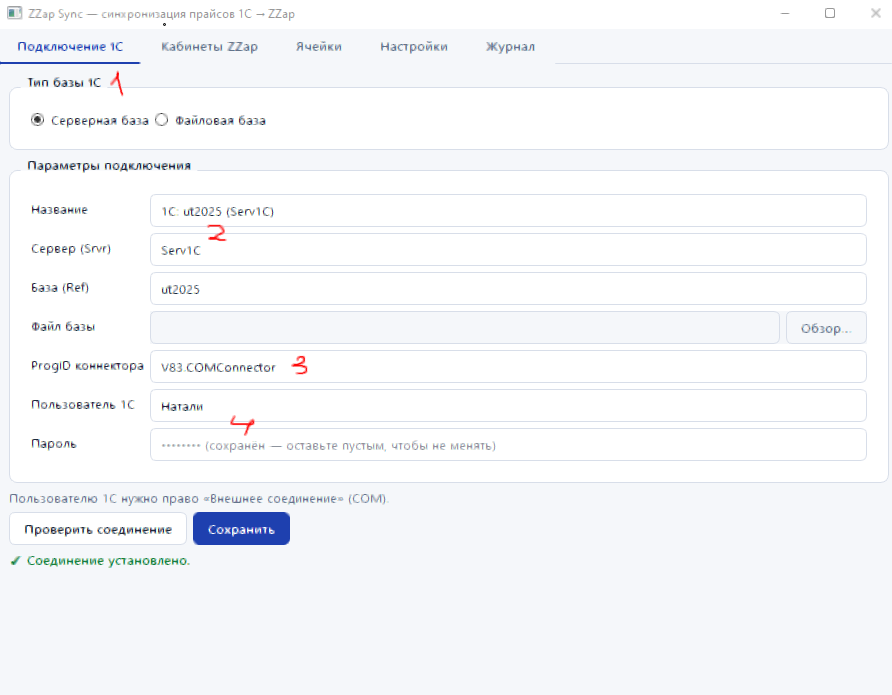
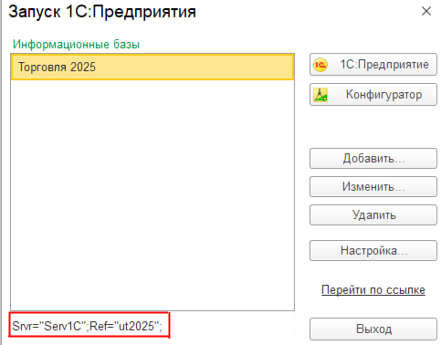
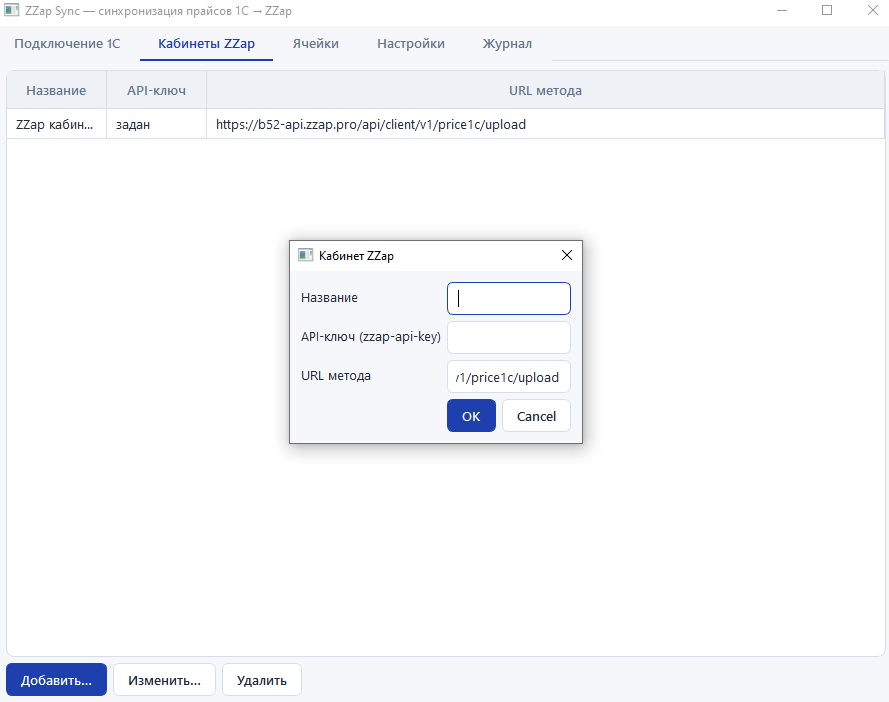
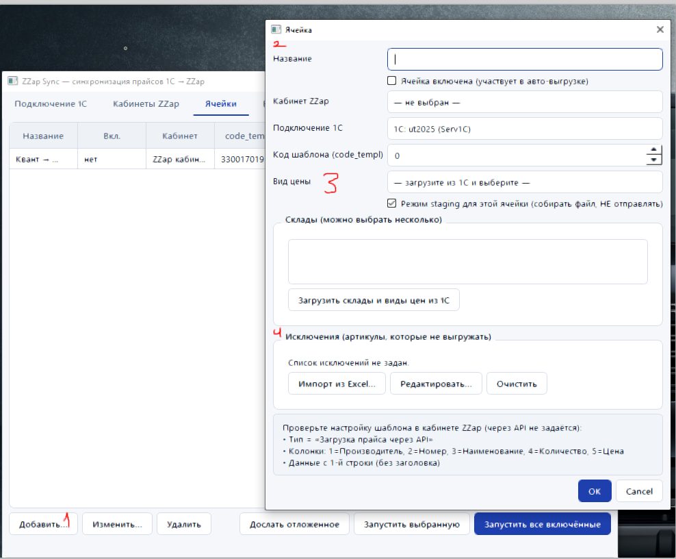
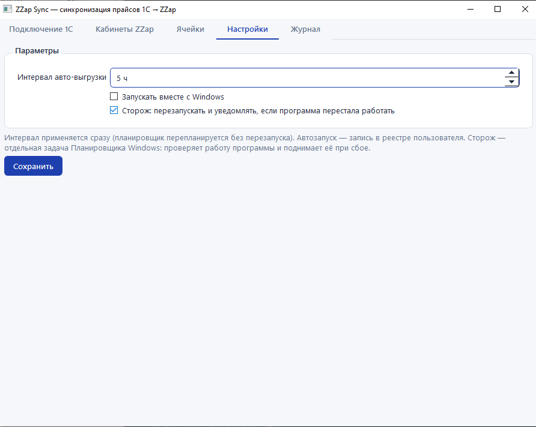
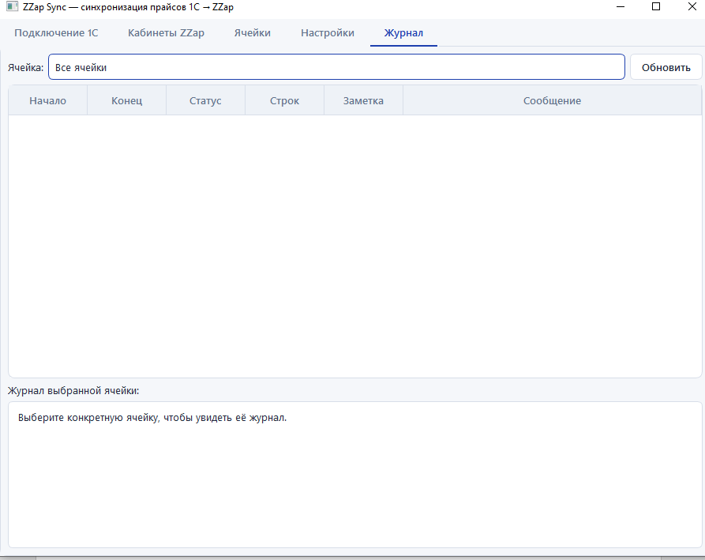
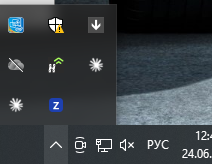
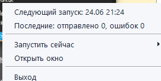

# ZZap Sync — синхронизация прайсов 1С → ZZap

Приложение автоматически выгружает прайс-лист из 1С в ZZap по расписанию. Работает
свёрнутым в системный трей, само отправляет данные каждые N часов, переживает обрыв
сети и выключение ПК (отправляет всё сразу при возобновлении), запускается вместе с
Windows и перезапускается «сторожем», если по какой-то причине остановилось.

Из этого же кода собирается **отдельное приложение «Рассылка прайса»**
(`PriceMailer-Setup-*.exe`) — вместо ZZap оно отправляет готовый Excel-прайс
**письмом на почту** по расписанию (см. раздел «Рассылка прайса на почту» ниже).
Оба приложения независимы и могут стоять на одном ПК одновременно.

## Установка

1. Скачайте установщик `ZZapSync-Setup-1.0.0.exe` из раздела
   [**Releases**](https://github.com/takemysoult/zzap-sync-app/releases/latest).
2. Запустите его (потребуются права администратора) и пройдите установку.
3. Запустите «ZZap Sync» и настройте программу по шагам ниже.

---

## Шаг 1. Подключение к 1С

1. Выберите тип вашей базы 1С — в большинстве случаев это серверная база.
2. Введите любое понятное название подключения.
3. Укажите параметры серверной базы (сервер и имя базы). Посмотреть их можно в окне
   запуска 1С (см. второй скриншот ниже — строка вида `Srvr="...";Ref="...";`).
4. Поле progid менять не нужно — оставьте значение по умолчанию.
5. Введите логин и пароль учётной записи 1С с полными правами (та же, под которой вы
   входите в клиент 1С). У этой учётной записи должно быть право **«Внешнее соединение»
   (COM)**.
6. Нажмите «Проверить соединение» (проверка занимает около минуты) и сохраните.

Где взять адрес сервера и имя базы — в окне запуска 1С:

---

## Шаг 2. Кабинет ZZap

Нажмите «Добавить», введите любое название и вставьте свой API-ключ из кабинета ZZap.
Третью строку (адрес) менять не нужно.

---

## Рассылка прайса на почту (отдельное приложение)

**«Рассылка прайса»** — самостоятельная программа из этого же кода: вместо ZZap она
отправляет собранный из 1С Excel-прайс письмом (вложением) на указанные адреса, по
расписанию, с трея, с досылкой при обрыве сети — всё как у ZZap Sync. Установщик:
`PriceMailer-Setup-<версия>.exe` (сборка: `packaging\build_mailer.ps1`). Приложение
полностью независимо от ZZap Sync (своя папка данных, свой автозапуск и сторож) —
их можно ставить рядом.

Настройка:

1. Вкладка **«Подключение 1С»** — как в ZZap Sync (шаг 1 ниже).
2. Вкладка **«Почта»** → «Добавить…»: введите свой ящик (с него будут уходить
   письма) — выберите провайдера (Mail.ru / Яндекс / Gmail — сервер и порт
   подставятся сами), укажите email и пароль.
   **Важно:** для Mail.ru, Яндекс и Gmail нужен **«пароль приложения»** — он
   создаётся в настройках безопасности почты; обычный пароль от ящика по SMTP не
   работает.
3. Нажмите «Отправить тестовое письмо…» и убедитесь, что письмо дошло.
4. На вкладке **«Ячейки»** создайте ячейку: подключение 1С, склады и вид цены — как
   обычно, плюс ящик-отправитель, получатели (можно несколько, через запятую) и,
   при желании, тема письма.
5. Дальше всё как в ZZap Sync: отправка по расписанию (интервал — в «Настройках»),
   при обрыве сети файл досылается автоматически, результаты видны в «Журнале».

---

## Шаг 3. Создание ячейки выгрузки

1. На вкладке «Ячейки» нажмите «Добавить».
2. Введите название ячейки, выберите кабинет (ЛКМ по строке и выберите из списка) —
   подключение подставится автоматически. Укажите код шаблона из ZZap (обратите
   внимание на настройку этого шаблона в самом кабинете ZZap).
3. Нажмите «Загрузить склады и виды цен из 1С» (загрузка занимает около минуты), затем
   выберите вид цены и склады, из которых данные будут выгружаться в этот шаблон.
4. При необходимости можно добавить список артикулов, которые не нужно выгружать
   (кнопка «Импорт исключений из Excel»).
5. Повторите эти шаги для второго шаблона, если нужны раздельные выгрузки (например,
   отдельно с Б/У склада и отдельно с обычного).
6. Чтобы отредактировать готовую ячейку, выделите её и нажмите «Изменить» (или дважды
   щёлкните по ней ЛКМ).
7. Когда все ячейки настроены, нажмите «Запустить все включённые». Чтобы ячейка
   участвовала в выгрузке, отметьте в её настройках галочку «Ячейка включена».
8. Кнопка «Дослать отложенное» — для ручной отправки (если нужно выгрузить раньше, чем
   сработает таймер).

---

## Шаг 4. Настройки

Задайте нужный интервал автоматической выгрузки и включите «Запускать вместе с
Windows», чтобы при включении ПК выгрузка стартовала сразу. «Сторож» — функция, которая
перезапустит приложение и уведомит вас, если оно по какой-либо причине прекратит работу.
Нажмите «Сохранить».

---

## Шаг 5. Журнал и работа в трее

На вкладке «Журнал» отображаются результаты всех автоматических выгрузок.

Итог: после настройки приложение постоянно работает в системном трее (значок с буквой
**Z**).

Окно не обязательно держать открытым — программа продолжает работать в фоне. Чтобы
открыть окно, нажмите ПКМ по значку в трее и выберите «Открыть окно».

---

Техническая документация для разработчиков: [docs/README-dev.md](docs/README-dev.md),
[ROADMAP.md](ROADMAP.md), [PROJECT_MEMORY.md](PROJECT_MEMORY.md).
